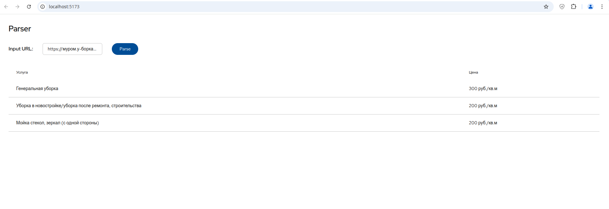

# Parser

> Note: This is a course work.

## 🪛 Requirements

* OS Linux
* docker-ce
* docker-ce-cli
* docker-compose

## 🚀 Build & Run production environment

```sh
docker compose up --build
```

## 🛸 Build & Run development environment

```sh
docker compose -f docker-compose-dev.yml up --build
```

> Also there is a few scripts in `automation` directory. Check it out!

## 📌 About

This is a course work for МиВЛгУ. There is a two sites that this parser can parse: https://муром.у-борка.рф and https://murom.gor-master.ru/kliningovie-uslugi.

## 🛠️ Hacking

To add functionality for another sites add new implementation for CleaningSiteInterface.java (Like GormasterCleaningSite.java for ex.) and add if statement for detect site typo in CleaningSiteFactory.java 

## Screenshots



.png>)